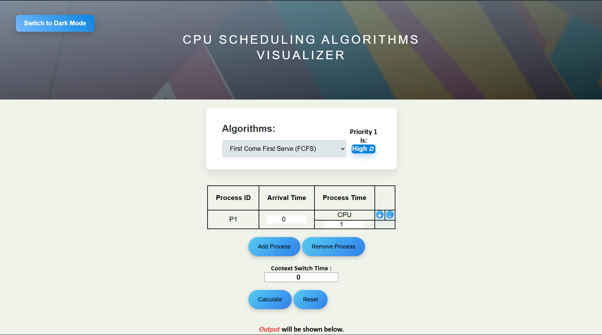
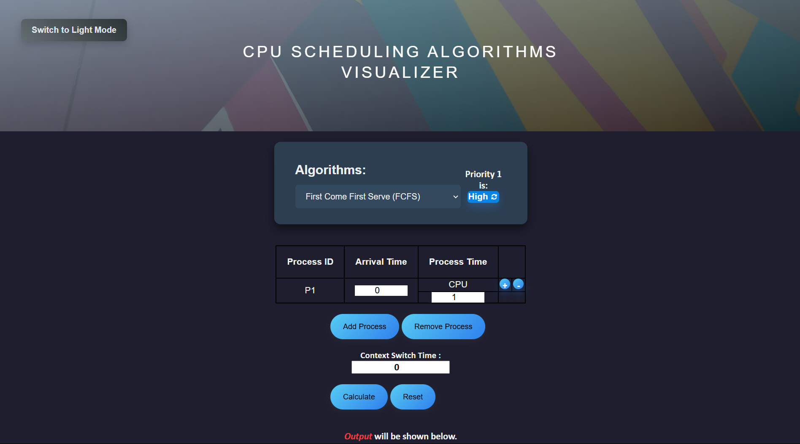

## OS CPU Scheduling Algorithm Visualizer

## Overview

The OS CPU Scheduling Algorithm Visualizer is a user-friendly tool designed to graphically illustrate the behavior of various CPU scheduling algorithms. It provides detailed insights into the scheduling periods, distinguishing between active processing times and idle intervals. This enhances understanding of system dynamics and performance.

## Screenshot

## Key Features

- Graphical Representation: Visualize scheduling periods with clear differentiation between active and idle intervals.

- Time Log: Gain a detailed visual overview of process execution to better comprehend system behavior and performance metrics.

## Nine Scheduling Algorithms: Compare and analyze the following algorithms:

- First Come First Serve (FCFS)

- Shortest Job First (SJF)

- Longest Job First (LJF)

- Shortest Remaining Job First (SRTF)

- Longest Remaining Job First (LRTF)

- Round Robin

- Priority (Non-Preemptive)

- Priority (Preemptive)

- Highest Response Ratio Next (HRRN)

## How to Use

- Clone the Repository:

git clone <repository_url>

- Open the Visualizer:

- Navigate to the project folder.

- Open the index.html file in your preferred web browser.

- Select an Algorithm:

- Use the dropdown menu to choose a scheduling algorithm.

- Input Process Details:

- Enter the required details for each process (e.g., arrival time, burst time, priority).

- Visualize and Analyze:

- Click the "Calculate" button to execute the selected algorithm.

- Observe the visualized results, including Gantt charts and other relevant metrics.

## License

This project is licensed under the MIT License.